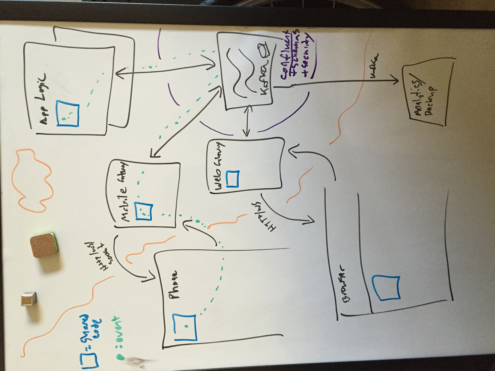

# Clojure Stack

An industry grade project using clojure everywhere. 

To be presented at ForwardJS 4.

## Purpose

A baseline Clojure stack that runs on any and all platforms, that is nice to develop and horizontally scalable.

## What's here?

; this should be generated

* Consistent, extensible, component-based, event-driven design pattern via Clojure
* Leiningen based multi-module project setup with modules for each platform
    * API via bidi with REPL control
    * Web via clojurescript / re-frame
    * iOS via clojure-objc / lein-objcbuild
    * Androd via clojure-android / lein-droid
    * Visualizer via Overtone
    * Core via component
* Integration with Vagrant and Marathon
* Scalable production deploment configuration
* Development environment mirroring production environment
* Jenkins configuration
* No bullshit (pull request if you disagree)


## Quick Start

    vagrant up && vagrant ssh
    curl -i -H 'Content-Type: application/json' -d @/develop/marathon-apps/check-env.json localhost:8080/v2/apps





## Philosophy

Much influence has been drawn from Continuous Delivery, The Reactive Manifesto, and the Lean Startup. Talks such as 
[Turning the Database Inside out]() and ___ have also had large influence.

### Claims


* Continuous Delivery shortens the feedback loop
* Using a single notation everywhere makes it easy to switch contexts
* Developing in a production-like environment minimizes surprises
* Automation is the best process documentation
* Strong typing need not be obtrusive and static, and is necessary for any evolving system
* EDN minimally represents all fundamental data structures; the end game of text formats
* Clojure is easy to read and understand, and is not quite LISP (it's EDN)
* Investment in Open Source Software leads to better software product outcomes
* Dependencies between features should be minimized, yet code sharing should be maximized and DRY
* Even side projects need 20% time
* Sometimes things break.


## Choices


### Clojure

The fundamental data structures representing code and data; nothing more, nothing less.

* Same language on and between all platforms
* core.async channels and CSP concurrency everywhere
* EDN everywhere, successor to JSON

#### core.async

Core.async provides buffered and unbuffered channels and macros to enable CSP concurrency, effectively making all arguments
for Go apply to Clojure in addition to the tooling and library support of the JVM. Additionally there is full integration
with transducers, allowing for composable and high performance computation (low gc pressure via stack). If we write all
components as transducers or reducers, we can run code anywhere and wire it together with core.async channels.

```clojure
(defn assoc-profile []
  (fn [event next]
    (let [profile (profiles (:myapp/userid event))
          new-event (if profile
                        (assoc event :profile profile)
                        event)]
      (next new-event))))
```

```clojure
(defn allow-language [lang]
  (fn [event next]
    (when (= (:myapp/lang event) lang)
      (next event))))
```


```clojure

(defn kv-store 
  ([key-fn val-fn]
     (kv-store key-fn val-fn (atom {}))
  ([key-fn val-fn kv-atom]
     (fn [event next]
       (let [k (key-fn event)
             v (val-fn event)]
         (next (case v
                     ::delete (swap! kv-atom disassoc k)
                     ; if v is a list then the first will be the function and the rest the args.
                     ; eg. 
                     ; {:component/event :kv-store/update
                     ;  :kv-store/key 123
                     ;  :kv-store/update-fn '(+ (:total-price event) (or prev 0))}
                     ::update (let [update-fn (eval (:kv-store/update-fn update-fn))]
                                (swap! kv-atom update k update-fn event))
                     :else (swap! kv-atom assoc k v)))))
                     
                     
(def latest-value kv-store) ; alias

(defn nearby [user-id other-user-id max-distance] (fn [event] (and (not= (:user-id %) user-id) (>= max-distance (distance 

(defn users-nearby [users]
  (fn [event next]
    (let [user-id (:user-id event)
          location (:location event)]
      (swap! users assoc user-id location)
      (let [nearby-users (into [] (comp (filter (fn [[k v]]
                                                (when (distance )))])))


```

#### Codox


```
  ; todo lein-modules should automate this if lein-codox is here. (or vice, versa).
  :codox {:source-paths ["web-client/src"
                    "web-client/dev-src"
                    "web-backend/src"
                    ;"visualizer/src"
                    ;"pubsub-service/src"
                    ;"ios-client/src"
                    ;"core/src"
                         ]
          :namespaces [#"^example\."]
          :doc-paths ["doc"]
          :metadata {:doc "FIXME: write docs"}
          }
          
          
          ; this machinery could maybe be used to help intellij load source paths.       
```

Running as a dedicated doc module is cleaner than having profiles on the top level profject for specific tasks. 
the reason we need multiple build modes for doc is that ithe clojure and clojurescript docs are generated separatel. 
.net or objc docs might also have different generation profiles.

`:codox {:language :clojurescript}`

`:codox {:metadata {:doc/format :markdown}}`

```
(defn foo
  "A **markdown** formatted docstring."
  {:doc/format :markdown}
  [x])
```

#### reagent

Based on reagent, which using a special atom as the client side sate. Stacks a nice pattern for composable reactive
processing of UI actions. Plays well with CQRS and Doman Driven Design.


#### Sente


https://github.com/ptaoussanis/sente

https://github.com/ebellani/carpet - example shared source web + mobile project.

http://docs.confluent.io/2.0.0/kafka-rest/docs/intro.html#quickstart


#### component

"Just enough structure"

A separation of concerns model for use on all platforms.

We use a custom lifecycle dispatcher that uses multimethods, as suggested by the author's documentation.

Actually this style [is much slower](http://insideclojure.org/2015/04/27/poly-perf/) than Protocol based dispatch, 
but very nice to work with. [Or not](http://stackoverflow.com/questions/28577115/performance-of-multimethod-vs-cond-in-clojure).

```
Multimethods: 6.26 ms
Cond-itionnal: 5.18 ms
Protocols: 6.04 ms
```


```clojure
(ns my.component
  (:require [clojure.tools.logging :refer [debugf infof]
            [component :refer [react-to] :as c]))
  
(defmulti react)

; namespaced keywords for dispatch
; (when (= *ns* 'my.component) (= ::my-message :my.component/my-message))

(defmethod react :component/start [component]
  (debugf "Starting my.component"))
  
(defmethod react :component/stop [component]
  (debugf "Stopping my.component"))

(defmethod react ::my-message [component event]
  (infof "Got a event, what are we going to do about it? %s" event))

; alternative syntax (experimental)
(react-to ::my-message [event]
  (infof "Got an event, what are we going to do about it? %s" event))
```


A comparable protocol-based approach loses some of its niceness, but may win in dispatch speed. A macro could be constructed
to use an in-memory map based dispatch (ie. constant lookup time).


```clojure
(ns my.component
  (:require [clojure.tools.logging :refer [debugf infof]
            [component :refer [event-key Lifecycle]]))
  
(defrecord Reactor [dispatch]
  Lifecycle
  (start [component]
    (debugf "Starting my.component"))
  (stop [component]
    (debugf "Stopping my.component"))
    
  React
  (react [component event]
    (when-let [handler (get dispatch (event-key event))]
      (handler component event))))


(defn- my-message [component event]
  (infof "Got an event, what are we going to do about it? %s" event)

(def component (->Reactor {::my-message my-message}))

;(react component event)
```


#### Prismatic Schema

Progressive typing support; prismatic gives alternative `defn`, `defrecord`, etc which allow creating types via
a simple DSL:

```
(def MyEvent
  "A schema for a nested data type"
  {:a {:b s/Str
       :c s/Int}
   :d [{:e s/Keyword
        :f [s/Num]}]})

(defmulti react [component event :- MyEvent] :component/event)
```

The `:-` operator works in much the same way as the same way as the `^` operator but is more rich (see doc for more
info).


#### Dispatcher

Dispatchers are components that implement the Dispatcher protocol.

Mock the core.async pub/sub API.

https://yobriefca.se/blog/2014/06/04/publish-and-subscribe-with-core-dot-asyncs-pub-and-sub/

```clojure
(defprotocol Dispatcher
  (dispatch! [_ event event-data])
  (subscribe [_ event-pred]))
  
(defrecord LocalDispatch []
  component/Lifecycle
  ; ...
  Dispatcher
  (dispatch! [c event event-data]
    ; ...
    )
  (subscribe [c event-pred]
    ; ...
    ))
    
(defrecord SenteDispatch []
  component/Lifecycle
  ; ...
  Dispatcher
  (dispatch! [c event event-data]
    ; ...
    ))
    
(defrecord KafkaDispatch [topic]
  component/Lifecycle
  ; ...
  Dispatcher
  (dispatch! [c event event-data]
    ; ...
    ))
    
(defrecord OnyxDispatch [topic]
  component/Lifecycle
  ; ...
  Dispatcher
  (dispatch! [c event event-data]
    ; ...
    ))
    
    
    
```


### Marathon deployment

12 Factor App

Deploy non-Docker packages. Nothing in particular against Docker, but I don't see the case for it with Marathon 
and debootstrap.

Marathon gives the concept of [Application Groups](https://mesosphere.github.io/marathon/docs/application-groups.html), which inject environmental variables into
containers which con be used for discovery.


> Applications can be nested into a n-ary tree, with groups as branches and applications as leaves. Application Groups are used to partition multiple applications into manageable sets.


* *kafka*
* notes service - kafka
* web app - notes service
* ios service - notes service
* android service - notes service
* ios app - *app store*
* android app - *android market*

This is the fully expanded view. Initially you may have a single service for all apps, but it is recommended
to at-least create distinct routes for each type of view. The reason for this is to minimize dependencies. Italic
means external / not explicitly deployed with this app group.


```
{"id": "notes.prod",
 "apps": [{"id": "notes.notes-service.prod",
           "command": "ENV=prod KAFKA=kafka:9092 java -jar notes-service.jar"},
          {"id": "notes.web.prod",
           "command": "ENV=prod NOTES_SERVICE=notes.notes-service.prod java -jar notes-web-standalone.jar",
           "dependencies": ["notes.notes-service.prod"]},
          {"id": "notes.ios.prod",
           "command": "ENV=prod NOTES_SERVICE=notes.notes-service.prod java -jar notes-ios-standalone.jar",
           "dependencies": ["notes.notes-service.prod"]},
          {"id": "notes.android.prod",
           "command": "ENV=prod NOTES_SERVICE=notes.notes-service.prod java -jar notes-android-standalone.jar",
           "dependencies": ["notes.notes-service.prod"]}
          ]}
```

#### Mesos DNS (service discovery)

http://mesosphere.github.io/mesos-dns/

Using this, DNS names have a convention based on the container ID. We could thus be implicit about DNS names of
services, but it is better practice to pass them in explicitly at deployment/run time for separation of concerns.


#### Backend per view

This means that we have an endpoint for iOS, Android, Web. Core logic is required by each, but the view details
may vary slightly if only in deployment schedule.


### Distributed Authorization

- Each entity has an identity.
- Unauthenticated entities have auto-generated identities until they authenticate.


### Ansible

familiar with it. yaml basaed DSL. as simple as you want it to be. downside? not edn.

### Ubuntu

APT
debootstrap

We can bootstrap our deployments down to the Kernel level if need-be, but ideally we're deploying to an ubuntu
system that has all of our dependencies such as a JDK provisioned by Ansible or Packer.

A `.deb` gives us system-level instructions for how to install a package. It may contain upstart info, or other
ways to invoke the services it contains. Given that container systems want an entry point, that functionality
is largely un-used. One could interpret the upstart init script to build a command to run.


### Kafka

Kafka is a replicated append-only log service that works in sergments of key/value messages. The key can serve as
a primary key with compacted storage or a partition key to balance work amongst subscribers. In our case it is the
primary data store from which our aggregate state is built.

It serves as a persistent store and buffer against back-pressure and cascading failures.

### ZooKeeper

ZooKeeper is a quorum based distributed coordinator with strong consistency. Beyond that, it can be coded against as a 
hierarchical k/v store with watches. In reality, if there is a failure event on a client ZK will get a new master elected
or establish a new quorum automatically (not necessarily quickly, sadly).


https://github.com/liebke/avout


```
(defprotocol VersionedStateContainer
  (initVersionedStateContainer [this])
  (destroyVersionedStateContainer [this])
  (getStateAt [this version])
  (setStateAt [this value version])
  (deleteStateAt [this version]))
  
(defrecord FluxAtomMaster [in out]
  VersionedStateContainer
  (initVersionedStateContainer [this])
  (destroyVersionedStateContainer [this])
  (getStateAt [this version]
    )
  (setStateAt [this value version])
  (deleteStateAt [this version]))

(defrecord FluxAtomSlave []
  VersionedStateContainer
  (initVersionedStateContainer [this])
  (destroyVersionedStateContainer [this])
  (getStateAt [this version])
  (setStateAt [this value version])
  (deleteStateAt [this version]))
```


## Tool suggestions

* IntelliJ Idea with Cursive (free licenses for OSS!)

* emacs with clojure-mode and org-mode

* homebrew + cask

* zsh + iTerm2

* White on black Hack font

* F.lux


## Design

### Different types of compnents

Think of a component as a binary, and channels as standard in/out. Some binaries run on servers, others on phones, others 
on desktop computers, etc. Each has different capabilities, a common one being POSIX. When you write a component in Clojre,
you think in terms of the capabilities of a system. Component helps us manage these.


```clojure

(defn example-system [config-options]
  (let [{:keys [host port]} config-options]
    (component/system-map
      :config-options config-options
      :pubsub (pubsub (:pubsub-upstream config-options))
      :ga (google-analytics (:ga-config config-options))
      :app (component/using
             (ios-client config-options)
             {:database  :db
              :scheduler :scheduler}))))
              
(def system (component/start (example-system {}))


```

### Communication between components

Communication happens through an injected communication system comopnent. Pubsub is the natural choice that comes to mind,
given that components can emit and respond to commands and events. A command is request that can be fulfilled or not, with
one sender and 1 receiver. An event is a notification of a mutation that happened to the system. A query is a subsctiption
to an event stream.


### Extensible component component

```clojure
(defmulti react [component event] :component/event)

(defmethod react :component/extend [component event]
  (let [component-ns (resolve (:ns event))
        new-method (:react event)]
    (binding [*ns* component-ns]
      (eval new-method))))

(defmethod react :component/extend [component event]
  (let [component-ns (find-ns (:ns event))
        new-method (:react event)]
    (binding [*ns* component-ns]
      (eval new-method))))
```


Mutator component

- Drop into debug mode for live sessions. 
- Push app updates.
- Access controlled... grant entities access.


### Remote Atom

Idea:

- routing for subkey balancing -- atomic in ZK w/ zk-atom
- browser creates atom that is materialized from upstream
- synchronize atom into r/atom (perf of calculating update?)
- atom over redis/memcache? -- if you need this, you might be designing wrong. kafka is master, partition is everything.
- subscribe with a predicate, channel is a special case. #(= (:channel %) "my-channel")


### Component-based System Design

```clojure
(defn my-thing [main-ui] [:div "regular reagent component"])

(defrecord MainUI [loc]
  c/Lifecycle
  (start [c]
     (r/render-component (my-thing c) loc))
  (stop [c] 
     (comment "cleanup")))

(let [ps (pubsub ...)
      events-upstream (subscribe ps #(= (:channel %) "my-channel")) ; a channel
      events (pipe events (r/atom) false) ; pipe returns "to" channel
      system-map (c/system-map {:ps ps :events events})]
  (reset! system (c/start system-map))
```


```clojure
(defn new-session [req]
  (comment "create kafka consumer subsription, pipe updates through reactor and out to client."))

(defn component-handler [req]
  (let [input-chan (pipe (http-channel req) (new-session req) false)]))

(defrecord NginxAppServer [port]
  c/Lifecycle
  (start [c]
    (http-)
  (stop [c])
  
  WithRingApp
  (app [c]
    (let [handler (comment "normal ring handler, middleware etc")]
      handler)))
```


```clojure
(defrecord Subscription [in out predicate])

(def subscriptions (atom {})) ; this could be a zk-atom... = coordination among peers >:]

(defn publish [req]
  (kafka/publish ...))

(defn subscribe [req]
  (swap! subscriptions assoc sub-id (->Subscription ...))
  
(defn history [req]
  (let [range (comment "offset, count from request")]
    (comment "git history from requested offset))

(defn unsubscribe [req])

(defn update-consumers [watch-key consumers old new]
  (let [[old-subscriptions new-subscriptions common-subs] (clojure.data/diff old new)
        to-add (comment "find add from diff")
        to-remote (comment "find remove from diff")]
    (doseq [to-add]
      )
    (doseq [to-remove]
      )))

; keep kafka consumers in sync in a decoupled way :)
(add-watch subscriptions :update-consumers update-consumers)

```


### Overtone

One sunny Saturday after a long week of rain between Trance and data streams humble author had an idea. He should've 
been working on his Clojure demo but he wanted to hack some music instead. Why not both?

> Hack the planet.

Connect and generate music from your streams. Indicates traffic pulse intuitively using pitch and tone.

https://github.com/quil/quil#api-exploration
 
This is a cool trick. Interactive API docss in Clojure.
 


### Aggregate Objects

After two years of clojure and data stream programming, one begins to think of all objects as aggregates of the
events that it they have experienced. What is a key/value store? A sequence of keys and values. How can we build one?

1. `(write {:key "harlan.name.first" :value "Harlan"})`, we'll use `[harlan.name.first Harlan]` for brevity.
2. `[harlan.name.last Iverson]`
3. `[harlan.job Hair Stylist]`
4. `[alice.name.first Alice]`
5. `[alice.name.last Simply]`
6. `[alice.job Programmer]`

```
{"harlan.name.first" "Harlan"
 "harlan.name.last" "Iverson"
 "harlan.job" "Hair Stylist"
 "alice.name.first" "Alice"
 "alice.name.last" "Simply"
 "alice.job" "Programmer"}
```

7. `[harlan.job Programmer]`

```
{"harlan.name.first" "Harlan"
 "harlan.name.last" "Iverson"
 "alice.name.first" "Alice"
 "alice.name.last" "Simply"
 "alice.job" "Programmer"
 "harlan.job" "Programmer"}
```

The rule here is to have one slot per key that can hold a value, and keep the latest one we receive; remember, 
these are write events. Thankfully Computer Science gave us the Dictionary data structure that we can leverage:

```clojure
(def assoc clojure.core/assoc) ; not needed, just for example. works on dictionaries, ka maps.

(defn kv-store []
  (let [store (atom {})]
    (fn [event] (swap! store assoc (:key event) (:value event))))
```

We can image more interesting objects, like summation or moving average. I am using objects more in the logic sense than
the OOP sense.

```clojure
(defn- inc [value] (+ 1 (or value 0)))

(defn sum []
  (let [value (atom 0)]
    (fn [event] (swap! value inc)))
```

```clojure
(defn- cma-pair [[i avg] value]
  (let [new-i (+ 1 i)
        new-avg (/ (+ avg value) new-i)]
    [new-i new-avg]))

(defn cma []
   (let [state (atom [0 0])]
     (fn [event] (second (swap! state update cma-pair (:value event))))))
```


These are foundational events. Let's try something more advanced:


```clojure
(defn cma []
   (let [state (atom [0 0])]
     (fn [event] (second (swap! state update cma-pair (:value event))))))
```


Stream Middleware.

https://github.com/pyr/riemann-kafka

Riemann + Kafka...


http://allthingshadoop.com/2014/04/18/metrics-kafka/


These aggregate objects can be composed using Clojure's inbuilt `(comp)` function.

```
;

(defrecord EventsByCountry [users number-of-users]
  (init []
    {:users (atom (or users (kv-store)))
     :number-of-users (atom (or number-of-users (count)))})
  (process [forward events event]
    (swap!  )))

(let [users (kv-store)
      number-of-users (count)]
  (do (users event)
      (number-of-users event)))
```


They can then be placed in pipelines as xforms on core.async channels.

```
;

(def input (chan))

(def 


```

### Project Archetypes

A powerful idea of maven was project archetypes that included multi-module projects. There's no reason Lein can't
do the same. It means committing to lein-modules or lein-subs... but a clever git branching strategy could make
updating code seamless.


Components are the lattice. Events are _. Systems are operational groups of components. Containers provide some elementary
systems, such as event bus and authentication. 


## Thanks

Thanks to all the authors and contributors of the projects used and literature referenced.
